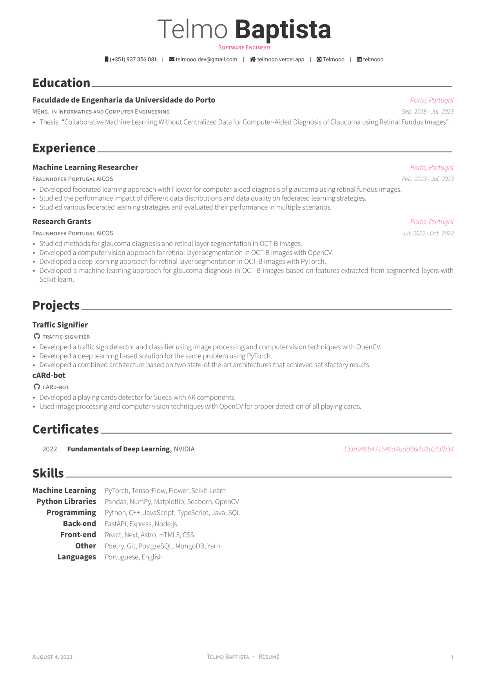

# My Résumé

Résumé based on [Awesome CV](https://github.com/posquit0/Awesome-CV), with some modifications to the layout and content.

## Build
Requirements:
- Full TeXLive distribution. (I use TexLive)
- Make
- ImageMagick and Ghostscript (for converting PDF to PNG) (disable in Makefile if you don't want this)

Use `make` to build the résumé, CV and cover letter.

## Preview

### Résumé

You can see PDF version [here](build/resume.pdf).

